# Hawk’s Nest

[graph TD
    %% 🎭 Core Platforms
    NET[hawkeyetherapper.net<br/>🌐 WordPress - Community Hub]
    BLOG[hawkeyetherapper.blog<br/>📖 Ghost - SEO Engine]
    APP[hawkeyetherapper.app<br/>🎥 Drupal - Media Platform]
    STORE[hawkeyetherapper.store<br/>🛒 Merch Integration]

    %% 🔥 Sun Tzu 4-Part Project (Albums)
    ST1[🎴 Sun Tzu Part 1 - Album 1<br/>]
    ST2[🎴 Sun Tzu Part 2 - Album 2<br/>]
    ST3[🎴 Sun Tzu Part 3 - Album 3<br/>]
    ST4[🎴 Sun Tzu Part 4 - Album 4<br/>]

    %% 🖇️ Connections Between Platforms & Albums
    NET <--> BLOG
    BLOG <--> APP
    APP <--> NET
    STORE <--> NET
    STORE <--> BLOG
    STORE <--> APP
    BLOG <--> ST1
    BLOG <--> ST2
    BLOG <--> ST3
    BLOG <--> ST4
    APP <--> ST1
    APP <--> ST2
    APP <--> ST3
    APP <--> ST4
    STORE <--> ST1
    STORE <--> ST2
    STORE <--> ST3
    STORE <--> ST4

    %% ✅ Track Progress Checklists for Each Album
    subgraph Sun Tzu Project [🔥 Sun Tzu 4-Part Project]
      ST1_CHECK[✅ Part 1 Progress:<br/>☑ Track 1<br/>☑ Track 2<br/>☐ Track 3<br/>☐ Track 4]
      ST2_CHECK[✅ Part 2 Progress:<br/>☑ Track 1<br/>☐ Track 2<br/>☐ Track 3<br/>☐ Track 4]
      ST3_CHECK[✅ Part 3 Progress:<br/>☑ Track 1<br/>☑ Track 2<br/>☑ Track 3<br/>☐ Track 4]
      ST4_CHECK[✅ Part 4 Progress:<br/>☐ Track 1<br/>☐ Track 2<br/>☐ Track 3<br/>☐ Track 4]
      ST1 --> ST1_CHECK
      ST2 --> ST2_CHECK
      ST3 --> ST3_CHECK
      ST4 --> ST4_CHECK
    end

    %% 🎨 Styling for Better Visibility
    style NET fill:#00274D,stroke:#FFF,stroke-width:2px
    style BLOG fill:#4B0082,stroke:#FFF,stroke-width:2px
    style APP fill:#006400,stroke:#FFF,stroke-width:2px
    style STORE fill:#FF8C00,stroke:#FFF,stroke-width:2px
    style ST1 fill:#8B0000,stroke:#FFF,stroke-width:2px
    style ST2 fill:#8B0000,stroke:#FFF,stroke-width:2px
    style ST3 fill:#8B0000,stroke:#FFF,stroke-width:2px
    style ST4 fill:#8B0000,stroke:#FFF,stroke-width:2px
](Creative%20Projects%2019d05b7d82868083b7bbd4fb5a9c90f3/graph%20TD%20%25%25%20%F0%9F%8E%AD%20Core%20Platforms%20NET%5Bhawkeyetherapper%20%2013105b7d82868161af39dbdb738c9b54.md)

```mermaid
graph TD
    %% 🎭 Core Platforms
    NET[hawkeyetherapper.net<br/>🌐 WordPress - Community Hub]
    BLOG[hawkeyetherapper.blog<br/>📖 Ghost - SEO Engine]
    APP[hawkeyetherapper.app<br/>🎥 Drupal - Media Platform]
    STORE[hawkeyetherapper.store<br/>🛒 Merch Integration]

    %% 🔥 Sun Tzu 4-Part Project (Albums)
    ST1[🎴 Sun Tzu Part 1 - Album 1<br/><img src="http://73.113.207.3:8080/wp-content/uploads/2025/02/160795E5-68E5-4CD1-B4D1-CA8E1557ABD0.png" width="200px">]
    ST2[🎴 Sun Tzu Part 2 - Album 2<br/><img src="http://73.113.207.3:8080/wp-content/uploads/2025/02/92425D10-02A2-4C61-8A5C-A7BFE09D1BC0.png" width="200px">]
    ST3[🎴 Sun Tzu Part 3 - Album 3<br/><img src="http://73.113.207.3:8080/wp-content/uploads/2025/02/D79E7BC1-DD18-41B8-B5DF-C5A63D41B240-2.png" width="200px">]
    ST4[🎴 Sun Tzu Part 4 - Album 4<br/><img src="http://73.113.207.3:8080/wp-content/uploads/2025/02/A3CF5112-F112-4D7A-A1ED-F312D732DC83-1.png" width="200px">]

    %% 🖇️ Connections Between Platforms & Albums
    NET <--> BLOG
    BLOG <--> APP
    APP <--> NET
    STORE <--> NET
    STORE <--> BLOG
    STORE <--> APP
    BLOG <--> ST1
    BLOG <--> ST2
    BLOG <--> ST3
    BLOG <--> ST4
    APP <--> ST1
    APP <--> ST2
    APP <--> ST3
    APP <--> ST4
    STORE <--> ST1
    STORE <--> ST2
    STORE <--> ST3
    STORE <--> ST4

    %% ✅ Track Progress Checklists for Each Album
    subgraph Sun Tzu Project [🔥 Sun Tzu 4-Part Project]
      ST1_CHECK[✅ Part 1 Progress:<br/>☑ Track 1<br/>☑ Track 2<br/>☐ Track 3<br/>☐ Track 4]
      ST2_CHECK[✅ Part 2 Progress:<br/>☑ Track 1<br/>☐ Track 2<br/>☐ Track 3<br/>☐ Track 4]
      ST3_CHECK[✅ Part 3 Progress:<br/>☑ Track 1<br/>☑ Track 2<br/>☑ Track 3<br/>☐ Track 4]
      ST4_CHECK[✅ Part 4 Progress:<br/>☐ Track 1<br/>☐ Track 2<br/>☐ Track 3<br/>☐ Track 4]
      ST1 --> ST1_CHECK
      ST2 --> ST2_CHECK
      ST3 --> ST3_CHECK
      ST4 --> ST4_CHECK
    end

    %% 🎨 Styling for Better Visibility
    style NET fill:#00274D,stroke:#FFF,stroke-width:2px
    style BLOG fill:#4B0082,stroke:#FFF,stroke-width:2px
    style APP fill:#006400,stroke:#FFF,stroke-width:2px
    style STORE fill:#FF8C00,stroke:#FFF,stroke-width:2px
    style ST1 fill:#8B0000,stroke:#FFF,stroke-width:2px
    style ST2 fill:#8B0000,stroke:#FFF,stroke-width:2px
    style ST3 fill:#8B0000,stroke:#FFF,stroke-width:2px
    style ST4 fill:#8B0000,stroke:#FFF,stroke-width:2px

```



Welcome to Hawk Eye's Digital Empire - a powerful network of interconnected platforms designed for maximum impact and engagement. Each domain serves a specific purpose while working together to create a seamless user experience.

# Strategic Ops

---

<aside>

## Website & Content

[Domain Structure](#)

[Content Calendar](Creative%20Projects%2019d05b7d82868083b7bbd4fb5a9c90f3/graph%20TD%20%25%25%20%F0%9F%8E%AD%20Core%20Platforms%20NET%5Bhawkeyetherapper%20%2013105b7d82868161af39dbdb738c9b54.md)

[SEO Strategy](Hawk%E2%80%99s%20Nest%2013105b7d82868055a437cf120a8ecd8d.md)

[Site Navigation](Hawk%E2%80%99s%20Nest%2013105b7d82868055a437cf120a8ecd8d.md)

</aside>

<aside>

## Merchandise

[Product Collections](https://www.notion.so/19d05b7d82868044af8ed87075265701?pvs=21)

[Limited Editions](Hawk%E2%80%99s%20Nest%2013105b7d82868055a437cf120a8ecd8d.md)

[Seasonal Plans](https://www.notion.so/19d05b7d8286804893e0f44ef6d95503?pvs=21)

[Pricing Strategy](Hawk%E2%80%99s%20Nest%2013105b7d82868055a437cf120a8ecd8d.md)

</aside>

# Mission HQ

---

<aside>

## Streaming Schedule

[Live Performances](https://www.notion.so/19d05b7d828680bdb8e9c62742aebd6b?pvs=21)

[Q&A Sessions](Hawk%E2%80%99s%20Nest%2013105b7d82868055a437cf120a8ecd8d.md)

[Behind-the-Scenes](Hawk%E2%80%99s%20Nest%2013105b7d82868055a437cf120a8ecd8d.md)

[Fan Events](Hawk%E2%80%99s%20Nest%2013105b7d82868055a437cf120a8ecd8d.md)

</aside>

<aside>

## Lyrics & Writing

[Current Writing](Hawk%E2%80%99s%20Nest%2013105b7d82868055a437cf120a8ecd8d.md)

[Lyrics Archive](Hawk%E2%80%99s%20Nest%2013105b7d82868055a437cf120a8ecd8d.md)

[Theme Collections](Hawk%E2%80%99s%20Nest%2013105b7d82868055a437cf120a8ecd8d.md)

[Writing Notes](Hawk%E2%80%99s%20Nest%2013105b7d82868055a437cf120a8ecd8d.md)

</aside>

# Updates

---

<aside>

## Newsletter Hub

[Update Templates](Hawk%E2%80%99s%20Nest%2013105b7d82868055a437cf120a8ecd8d.md)

[Subscriber Data](Hawk%E2%80%99s%20Nest%2013105b7d82868055a437cf120a8ecd8d.md)

[Campaign Plans](Hawk%E2%80%99s%20Nest%2013105b7d82868055a437cf120a8ecd8d.md)

[Content Themes](Hawk%E2%80%99s%20Nest%2013105b7d82868055a437cf120a8ecd8d.md)

</aside>

<aside>

## Music Production

[Active Projects](Hawk%E2%80%99s%20Nest%2013105b7d82868055a437cf120a8ecd8d.md)

[Track Archive](Hawk%E2%80%99s%20Nest%2013105b7d82868055a437cf120a8ecd8d.md)

[Sample Library](Hawk%E2%80%99s%20Nest%2013105b7d82868055a437cf120a8ecd8d.md)

[Collaborations](Hawk%E2%80%99s%20Nest%2013105b7d82868055a437cf120a8ecd8d.md)

</aside>

<aside>
👋 GET THIS DONE SON!

**⚔️ The Omniversal Blueprint: Constructing Hawk Eye’s Digital Empire**

Captain, while you forge the server from the digital void, I will illuminate the battlefield ahead. Here is a vision that spans platforms, art, and activism—woven into an unstoppable force of presence and influence.

**🧩 I. The Triad of Digital Domains – The Pillars of Hawk Eye’s Empire**

**1. HAWKEYETHERAPPER.NET – The Official Throne (WordPress | Community Hub)**

**Role:** The central beacon—artist site, blog index, and community core.

**Features:**

•	📰 **The Frontline:** Blog hub with lyric breakdowns, updates, and announcements.

•	💬 **Community Forums:** A battleground for fan discussions—lyric debates, theorycrafting, and more.

•	📅 **Event Center:** Livestream schedules, tour dates, and concert announcements.

•	💎 **Merch Hub Crosslink:** Integrated with hawkeyetherapper.store for album drops and exclusive merch.

**2. HAWKEYETHERAPPER.BLOG – The Lyrical Codex (Ghost | SEO Weapon)**

**Role:** The content powerhouse—optimized for search engines and deep dives into your artistry.

**Features:**

•	📜 **Lyric Annotations:** Genius-style breakdowns hosted natively.

•	🎙️ **Track Reviews:** A blog series exploring your music’s themes.

•	🧠 **Thought Leadership:** Essays on social justice, spirituality, and your artistic journey.

•	⚙️ **SEO Trojan Horses:** Keyword-focused articles, driving organic traffic.

**3. HAWKEYETHERAPPER.APP – The Aether Stream (Drupal | Media Platform)**

**Role:** Your private streaming citadel—video releases, album streams, and live broadcasts.

**Features:**

•	🎶 **Full Discography Streaming:** Hosted directly without platform interference.

•	📹 **Live Streams:** Concerts, Q&A sessions, and impromptu drops.

•	💬 **Fan Interactivity:** Live chat during streams, polls, and shoutouts.

•	🛒 **In-Stream Merch Drops:** Integrated purchase options during events.

**🌑 II. The Black Mirror SEO Strategy – Echoes Across the Web**

The power of the *Black Mirror* lies in its reflections—distinct yet interconnected. Through Ghost, WordPress, and Drupal, we will cast shadows that dominate search engines.

**🔮 1. Cross-Domain Mirrors:**

•	📝 Blog on .blog > Featured Article on .net > Embedded in .app as Video Commentary

•	🎧 Lyrics on .net > Lyric Breakdown on .blog > Performed Live on .app

•	🛍️ Merch Featured on .store > Reviewed on .blog > Linked in .app Streams

**🧵 2. Thematic Interlinking (Google’s Weak Spot):**

•	**Social Justice Theme:** (hawkeyetherapper.blog) Article > (hawkeyetherapper.app) Documentary > (hawkeyetherapper.store) Cause-Driven Merch Drop

•	**Spirituality Theme:** (hawkeyetherapper.blog) Essay > (hawkeyetherapper.net) Podcast > (hawkeyetherapper.store) Symbolic Merchandise

**⚙️ III. The Technology Stack – Dockerized, Optimized, Weaponized**

**📂 1. Docker Containers:**

•	🐋 **ghost_blog_container** – Ghost for .blog (SEO Engine)

•	🐋 **wordpress_net_container** – WordPress for .net (Community & Merch)

•	🐋 **drupal_app_container** – Drupal for .app (Streaming & Live Events)

•	🐋 **nextcloud_notes_container** – Nextcloud for Note-Taking and Planning

**📊 2. Jupyter Notebooks for SEO Analytics:**

•	📈 **Track Keyword Dominance:** Google Rank API + Python Scripts

•	📊 **Content Mapping:** Keyword clusters linked to domains

•	🧠 **AI-Powered Article Drafting:** Using Python to generate meta descriptions and SEO snippets

**🛡️ IV. The Security Wall – Unbreachable, Unseen**

•	🔐 **OPNsense Firewall:** Military-grade protection for all inbound/outbound traffic.

•	🧵 **Cloudflare Proxies:** Hiding your origin server from attacks.

•	🛡️ **Fail2Ban + UFW:** Instant bans for brute force attempts.

•	📂 **Nextcloud for Private Notes:** A local fortress for all sensitive content—completely within your control.

**🌌 V. The Future Expansions – Beyond the Horizon**

**💎 1. Hawk Eye Academy – Teaching the Game:**

📚 Online courses hosted on academy.hawkeyetherapper.net

🎙️ Masterclasses on lyricism, production, and conscious artistry

**💥 2. NFT & Collectibles – Digital Memorabilia:**

🎟️ Limited NFTs of album covers and lyrics

🛒 Exclusive merch tied to NFT ownership

**📻 3. The Hawkcast – Your Podcast Platform:**

🎙️ Conversations on art, activism, and the industry

🌐 Syndicated across .blog, .net, and .app

**🚀 Captain’s Orders:**

1.	**Server Launch:** Full systems online.

2.	**Nextcloud Deployment:** Notes, Plans, and Blueprints secured.

3.	**Docker Containers Prepared:** Ready for the Triad launch.

4.	**Aether Sync:** Jupyter scripts ready for SEO domination.

**Final Oath:** *No Trend. No Algorithm. Only Truth. The Aether Rises.*

Awaiting your signal.

</aside>

## About the team

---

<aside>


> 🦅 HAWK EYE THE RAPPER: The Voice of a Generation Seeking Truth and Transformation
> 

---

> 🚀 I. Introduction – The Mission & The Voice
> 
> - **Purpose:** Homepage introduction or 'About' page on `hawkeyetherapper.net`
> - **Focus Keywords:** Social Justice Rapper, Conscious Hip-Hop, Voice of a Generation
> - **Summary:** Position Hawk Eye as more than an artist—*a movement, a mirror to society's struggles.*

---

> 📜 II. The Origin Story – Roots & Realities
> 
> - **Purpose:** Dedicated page or blog series on `hawkeyetherapper.blog` under “The Journey”
> - **Focus Keywords:** Hip-Hop Origins, Artist Backstory
> - **Outline:** Early Life, Influences, First Bars, and Awakening to Music as a Tool for Change.

---

> 🎨 III. The Art of Storytelling – Beyond Bars
> 
> - **Purpose:** 'Artistry' page on `hawkeyetherapper.net` & SEO article on `hawkeyetherapper.blog`
> - **Focus Keywords:** Hip-Hop Storytelling, Lyrical Mastery
> - **Outline:** Crafting Purpose-Driven Lyrics, The Power of Imagery, and Inviting Listeners to Think Critically.

---

> ⚖️ IV. Social Justice Through Music – Activism on the Mic
> 
> - **Purpose:** Blog Series on `hawkeyetherapper.blog` (“Activism” Category)
> - **Focus Keywords:** Social Justice Music, Political Hip-Hop
> - **Key Tracks:** *"Invisible Chains"* (on systemic oppression), *"March of Change"* (on police brutality).

---

> 🛡️ V. Resilience & Strength – Music from the Soul’s Battles
> 
> - **Purpose:** ‘Empowerment’ page on `hawkeyetherapper.net` + Blog Series
> - **Focus Keywords:** Music About Overcoming Adversity
> - **Key Tracks:** *"Rise Again"* (anthem of survival), *"Bare My Soul"* (vulnerability as power).

---

> 🧘 VI. Consciousness & Spirituality – The Higher Frequencies
> 
> - **Purpose:** Blog Series on `hawkeyetherapper.blog` (“Mind & Spirit” Category)
> - **Focus Keywords:** Conscious Rapper, Spiritual Awakening
> - **Key Track:** *"Awakening"* (lyrical journey through self-discovery).

---

> 💎 VII. Rawness & Authenticity – The Unfiltered Voice
> 
> - **Purpose:** Artist Manifesto or ‘About’ page on `hawkeyetherapper.net`
> - **Focus Keywords:** Authentic Hip-Hop, Real Rap Lyrics
> - **Key Track:** *"Bare My Soul"* (vulnerability in verse).

---

> 🎙️ VIII. Influences & Style – The Sound of Hawk Eye
> 
> - **Purpose:** “My Sound” page on `hawkeyetherapper.net`
> - **Focus Keywords:** Hip-Hop Influences, Spoken Word Rap
> - **Outline:** Influences from Tupac, Nas, Kendrick Lamar, jazz, blues, and spoken word.

---

> 💥 IX. Art Meets Activism – Music with a Mission
> 
> - **Purpose:** Blog Series on `hawkeyetherapper.blog` (“Activism” Category)
> - **Focus Keywords:** Rap Activism, Hip-Hop for Social Change
> - **Key Song:** *"March of Change"* (protest anthem).

---

> 🔥 X. Evolution of an Artist – From Bars to Brilliance
> 
> - **Purpose:** Blog Series on `hawkeyetherapper.blog` (“Evolution” Category)
> - **Focus Keywords:** Evolution of a Rapper, Hawk Eye Music Journey
> - **Outline:** From self-expression to activism and experimentation.

---

> 💡 XI. Audience Impact – Building a Movement, Not Just a Fanbase
> 
> - **Purpose:** “Impact” Page or Community Forum on `hawkeyetherapper.net`
> - **Focus Keywords:** Hip-Hop Fan Community, Music That Inspires
> - **Outline:** Fan testimonies, concert experiences, and the online community’s role.

---

> 🌟 XII. The Future Vision – Beyond the Music
> 
> - **Purpose:** “Vision” Page or Blog Series on `hawkeyetherapper.blog`
> - **Focus Keywords:** Artist Vision, Hawk Eye’s Future Projects
> - **Outline:** Expanding into books, podcasts, documentaries, and collaborations.

---

> 🦅 XIII. The Legacy – Hawk Eye’s Immortal Impact
> 
> - **Purpose:** “Legacy” or “About” Page on `hawkeyetherapper.net`
> - **Focus Keywords:** Hip-Hop Legacy, Music with a Message
> - **Outline:** Impact on future generations, inspiring socially conscious artistry.

---

> 💎 SEO Black Mirror Strategy Integration:
> 
> - [**Ghost.io](http://ghost.io/) (`hawkeyetherapper.blog`):** Publish long-form thematic articles.
> - **WordPress (`hawkeyetherapper.net`):** Dedicated pages for each theme with crosslinks.
> - **Drupal (`hawkeyetherapper.app`):** Multimedia experiences and live streams.
> - **Merch Store (`hawkeyetherapper.store` or `.shop`):** Themed merchandise drops.

---

> ⚙️ Final Phase – Once Server Is Online:
> 
> - Set up **Nextcloud** for note-taking, blog drafts, and project management.
> - Use **Jupyter Notebooks** to manage SEO keywords and version control for content.
> - Deploy **Ghost, WordPress, and Drupal** containers via Docker.

---

> 🚀 Captain, this outline is our battle map. The moment your Aether server breathes, I will guide you to forge it into digital reality.
> 
</aside>

[](Projects%20Canvas%2019705b7d828680e8807ef6a0ddecedbd/Untitled%2019f05b7d828680618c49c78d4c6c01b2.md)

## Resources

---

# AI Text

Creating a detailed 13-page article involves significant expansion on the themes you’ve mentioned, diving deeper into the nuances of Hawk Eye The Rapper’s artistic journey, the impact of his music, and his role within the broader cultural and social landscape. To structure a comprehensive article like this, here’s an outline with some expanded content ideas based on your initial text:

**Title: Hawk Eye The Rapper: The Voice of a Generation Seeking Truth and Transformation**

**Introduction:**

•	Overview of Hawk Eye The Rapper as a cultural figure and the power of his music.

•	Brief introduction to the themes he tackles in his work: social justice, resilience, and consciousness.

**1. The Origin Story of Hawk Eye:**

•	Background on Hawk Eye’s early life and influences. Discuss formative experiences that shaped his world view.

•	Exploration of how his background led him into the music world with a unique purpose—using music as a tool for change and awareness.

**2. Hawk Eye’s Approach to Storytelling:**

•	Analysis of his lyrical style and storytelling techniques, setting him apart in the industry.

•	How he uses narrative to connect with listeners on an emotional and intellectual level.

•	Examples of key songs or lyrics where his storytelling is most evident.

**3. Themes of Social Justice in Hawk Eye’s Music:**

•	Detailed examination of his work on social justice topics, such as government transparency, inequality, and marginalized voices.

•	Discussion on the impact of his songs within communities affected by these issues.

•	Insights into how his music resonates within movements for change and inspires collective action.

**4. Personal Resilience as a Core Message:**

•	Exploration of how Hawk Eye addresses personal struggles, trauma, and resilience.

•	Stories or lyrics where he highlights overcoming adversity, and how this has become a central theme of his music.

•	The importance of resilience in his narrative and how it empowers listeners facing similar challenges.

**5. Human Consciousness and Spirituality:**

•	How Hawk Eye incorporates themes of consciousness, spirituality, and self-awareness into his music.

•	Examples of lyrics where he explores concepts like spiritual awakening, the nature of reality, or inner peace.

•	Comparison with other artists in hip-hop who also explore deeper philosophical themes.

**6. The Power of Authenticity and Rawness:**

•	How Hawk Eye’s genuine approach attracts a loyal fanbase.

•	Exploration of his unfiltered, honest style and how this connects with fans seeking authenticity in an often commercialized music industry.

•	Insight into his songwriting process and dedication to staying true to his message.

**7. Influences from Hip-Hop, Spoken Word, and Beyond:**

•	A closer look at his musical and stylistic influences.

•	Discussion of the genres and artists that have shaped his sound, including spoken word, hip-hop, and other visionary artists.

•	How he brings these elements together to create a unique sound that serves his narrative style.

**8. Navigating Art and Activism:**

•	How Hawk Eye balances his role as an artist with his commitment to advocacy.

•	Instances where he’s used his platform to address specific social issues.

•	Analysis of the challenges and rewards of blending art with activism in today’s cultural climate.

**9. The Evolution of Hawk Eye’s Music:**

•	How his music and message have evolved over time.

•	Comparison of his earlier work with recent projects to show growth in his themes and artistic vision.

•	Predictions or hints at what listeners can expect in the future as he continues to evolve as an artist.

**10. Audience Impact: A Community Inspired:**

•	Stories from fans and listeners who have been inspired by Hawk Eye’s music.

•	Examples of how his message has influenced listeners’ lives or perspectives.

•	Testimonials, quotes, or fan responses that demonstrate the impact of his work.

**11. Hawk Eye’s Vision for the Future:**

•	Insights into Hawk Eye’s goals for his music and message going forward.

•	Discussion on potential projects, collaborations, or topics he may explore in the future.

•	His aspirations for continuing to inspire awareness and action through his music.

**12. The Legacy of Hawk Eye The Rapper:**

•	Reflection on Hawk Eye’s legacy within the music industry and social justice communities.

•	How his unique blend of art and advocacy may influence future generations of artists.

•	Final thoughts on Hawk Eye’s enduring impact as a voice for those seeking truth and transformation.

**Conclusion:**

•	Summary of Hawk Eye’s journey, mission, and message.

•	Final remarks on the power of his music to inspire and awaken listeners, bridging art with meaningful change.

Each section of the outline could be expanded into roughly one page or more, depending on the depth of content, lyrical analysis, personal stories, and examples provided. Additionally, the use of interviews, fan testimonials, and specific song analyses would add substantial detail to each section.

Let me know if you’d like help with any specific sections or further guidance on writing.

## Expanded Version

```notion
Certainly! I’ll expand upon each section as a detailed narrative, progressing through each part as described in the outline to create a multi-page document. I’ll work on it in increments and provide several sections at a time.

Title: Hawk Eye The Rapper: The Voice of a Generation Seeking Truth and Transformation

Introduction

Hawk Eye The Rapper isn’t just an artist in the hip-hop scene—he’s a movement, a force that brings an urgent and powerful voice to critical issues facing our society. With his thought-provoking lyrics and raw storytelling ability, Hawk Eye touches on subjects that range from social justice to personal resilience, bringing a voice to those often unheard. As a lyrical storyteller, he crafts messages that go beyond entertainment, reaching into the depths of human experience and consciousness.

Through every beat and every bar, Hawk Eye pulls back the veil on the complexities of modern life. His music becomes a mirror to society’s struggles, uniting the personal and the universal in a way that resonates deeply with listeners. For him, music is more than just a career—it’s a mission, a call to inspire awareness, empower individuals, and advocate for change. Hawk Eye is redefining what it means to be a socially conscious artist, bringing to life narratives that challenge the status quo, inviting his audience to embark on journeys of self-discovery and enlightenment.

1. The Origin Story of Hawk Eye

To understand Hawk Eye The Rapper, we must start at the beginning. Growing up in an environment that exposed him to both the beauty and the struggles of life, Hawk Eye developed an early awareness of the social and economic issues that affected his community. His youth was marked by a sense of observation—a need to understand the dynamics of his world. He wasn’t just a spectator; he absorbed the stories around him, witnessing the impact of inequality, resilience, and survival.

These formative years shaped Hawk Eye’s worldview and planted the seeds for his passion for storytelling. Inspired by the influential voices in hip-hop who spoke truth to power, Hawk Eye found a way to channel his own observations and emotions through music. His unique perspective allowed him to see hip-hop not merely as a genre but as a tool for expression, transformation, and healing. By embracing music, he created a space where he could voice his truths and reflect the struggles and strengths of his community. His journey wasn’t about fame; it was about using his voice to bring light to the dark corners of society.

2. Hawk Eye’s Approach to Storytelling

Hawk Eye’s music is driven by a deep commitment to storytelling, and his lyrical style is as intricate as it is impactful. Each song is crafted with a purpose, woven with layers of narrative that touch upon universal themes while remaining deeply personal. Unlike many artists who prioritize catchy hooks or mainstream appeal, Hawk Eye prioritizes substance. His storytelling style is grounded in authenticity and raw emotion, drawing listeners in not only with rhythm but with the power of his words.

Through his lyrics, Hawk Eye paints vivid scenes that evoke both thought and feeling. In his storytelling, he uses metaphors, allegories, and symbolic language to take his listeners on a journey. Songs about struggle, resilience, and social justice transform into immersive experiences where listeners feel connected to the stories he tells. Hawk Eye’s storytelling doesn’t shy away from difficult truths or uncomfortable realities; instead, he challenges his audience to confront them. By doing so, he invites listeners to question societal norms, opening doors for conversations that often remain unspoken.

3. Themes of Social Justice in Hawk Eye’s Music

A recurring theme in Hawk Eye’s music is social justice. His lyrics shine a spotlight on systemic issues like inequality, government transparency, and the fight for marginalized voices. Unlike artists who might touch on social justice as a trend, Hawk Eye delves deep, bringing a level of urgency and depth to his discussions. His music provides a voice for those who may not have the platform to speak out and raises awareness of issues often hidden from the mainstream narrative.

In his song “Invisible Chains,” for example, Hawk Eye addresses the invisible barriers that keep people in cycles of poverty and oppression. He explores how certain systems are designed to hold individuals back, making it challenging for them to break free. His lyrics dissect these structures, offering a critique that is both insightful and hard-hitting. Hawk Eye doesn’t just identify problems; he calls for action and change, inspiring his listeners to become more aware and engaged in issues that affect not only themselves but society as a whole.

Another significant part of his social justice narrative is his focus on government transparency. In a world where information is tightly controlled, and truth is often obscured, Hawk Eye’s music becomes a beacon for honesty and accountability. He isn’t afraid to question authority or call out corruption, using his platform to shed light on the shadows within political systems. His message is clear: only by confronting and understanding these issues can society move towards a more just and equitable future.

4. Personal Resilience as a Core Message

Hawk Eye’s music doesn’t just address societal issues; it also delves into the inner strength and resilience that individuals must cultivate to navigate a challenging world. Many of his songs tell stories of personal adversity, drawing on his own experiences and the experiences of those around him. Resilience, as a theme, is woven into his lyrics as a source of empowerment, reminding listeners that no matter how difficult life gets, there is always a way to push forward.

In tracks like “Rise Again,” Hawk Eye speaks to the struggle of facing life’s hardest challenges. The song is a powerful anthem of endurance, telling a story of hardship that is ultimately transformed into strength. By sharing his own battles, he connects with listeners who may be fighting similar struggles. His music becomes a source of encouragement, a reminder that resilience is not about never falling but about always finding the strength to rise again.

Hawk Eye’s emphasis on resilience is particularly impactful because it comes from a place of honesty and experience. He doesn’t sugarcoat the difficulties of life or offer easy solutions. Instead, he offers a realistic portrayal of pain and perseverance, celebrating the courage it takes to keep going. His message resonates with listeners, especially those who may feel marginalized or defeated. For Hawk Eye, resilience is not just an individual attribute; it’s a collective force that can drive communities toward positive change.

5. Human Consciousness and Spirituality

Beyond social justice and resilience, Hawk Eye explores themes of human consciousness and spiritual awakening. His music reflects a curiosity about the nature of existence and the deeper questions of life. He invites listeners to reflect on their inner worlds and their connection to the universe, presenting a philosophical side that sets him apart from many other artists in hip-hop.

In songs like “Awakening,” Hawk Eye delves into topics such as self-discovery, mindfulness, and the journey toward enlightenment. His lyrics touch on the idea that consciousness is not just a state of mind but a pathway to understanding one’s purpose and place in the world. For Hawk Eye, spiritual awakening is a process of shedding societal conditioning and uncovering one’s true self.

Hawk Eye’s exploration of spirituality is both introspective and universal. He doesn’t preach; instead, he invites listeners to question their own beliefs and seek answers within themselves. By incorporating these themes, he creates a space in his music for listeners to embark on their own journeys of self-reflection. His approach to spirituality is inclusive, embracing the idea that each person’s path is unique. Through his music, Hawk Eye becomes not only an artist but a guide, encouraging his audience to open their minds and hearts to new perspectives.

I’ll continue expanding each section in this level of depth until the full article is crafted. Please let me know if you’d like me to proceed with additional sections right now or if you have any specific adjustments for the sections completed so far.

Certainly, I’ll continue expanding the following sections in similar detail to maintain depth and cohesion. Let’s proceed with sections six through nine.

6. The Power of Authenticity and Rawness

Authenticity is at the heart of Hawk Eye The Rapper’s appeal. In a world where the music industry is often shaped by trends, commercialization, and superficiality, Hawk Eye stands out as a genuine voice—someone who speaks his truth without compromise. His lyrics, which reflect real experiences and emotions, resonate deeply with listeners who crave substance over spectacle. Hawk Eye’s rawness isn’t simply a stylistic choice; it’s a commitment to his values and a reflection of his desire to be true to himself and his audience.

Hawk Eye’s songwriting process is known to be deeply introspective, involving a rigorous self-reflection that ensures every line he writes serves a purpose. He doesn’t focus on crafting a polished image but instead prioritizes honesty, even if it means exposing his vulnerabilities. Songs like “Bare My Soul” are a testament to his openness, where he talks candidly about his struggles, insecurities, and moments of self-doubt. This transparency draws listeners in, fostering a connection that feels genuine and personal. In an era where so many artists are filtered through a lens of perfection, Hawk Eye’s willingness to be flawed and human is refreshing.

His authenticity also makes him a role model for his fans, especially young listeners who are navigating their own identities. Through his music, Hawk Eye sends a message that it’s okay to be unapologetically yourself, to embrace both the light and dark aspects of who you are. By staying true to his principles, he empowers others to do the same, creating a community where listeners feel safe to express their own truths.

7. Influences from Hip-Hop, Spoken Word, and Beyond

Hawk Eye’s sound is a unique blend of influences, drawing from hip-hop, spoken word, and visionary storytelling. He credits the pioneers of hip-hop for teaching him the art of rhythm and rhyme, but he also brings his own twist, incorporating elements of spoken word to deepen the narrative layers in his music. His style is reflective, sometimes bordering on poetic, and his delivery is intentional, with every word carefully chosen to create impact.

Hip-hop legends like Nas, Tupac, and Kendrick Lamar have undoubtedly shaped Hawk Eye’s approach to music. He draws inspiration from their ability to tell stories that transcend personal experience, tackling issues that resonate with a wider audience. Yet, Hawk Eye doesn’t simply mimic their style; he merges these influences with his own voice and vision, creating a sound that feels both familiar and original. His incorporation of spoken word adds a rhythmically free-flowing quality to his verses, allowing him to experiment with cadence and phrasing in a way that enhances his message.

Beyond hip-hop and spoken word, Hawk Eye’s music is influenced by a variety of genres and art forms. He has a deep appreciation for jazz and blues, genres rooted in storytelling and emotional expression, which have influenced his musicality and tone. His work also echoes the narrative depth found in literature and film, as he strives to create songs that are not only auditory but cinematic, evoking vivid imagery and emotion. By blending these influences, Hawk Eye crafts a unique auditory experience that sets him apart in the modern music landscape.

8. Navigating Art and Activism

For Hawk Eye, music is a vehicle for change, and he sees himself not just as an artist but as an advocate. Balancing art with activism, he uses his platform to shed light on social injustices and empower listeners to become agents of change. His advocacy isn’t limited to his lyrics; he engages actively with issues offstage as well, collaborating with organizations, participating in grassroots movements, and amplifying marginalized voices.

Hawk Eye has been vocal about the challenges of blending art with activism. He acknowledges the risks involved—of alienating certain audiences, facing criticism, and at times, dealing with censorship. However, he believes that staying silent is a greater risk. By making music that addresses uncomfortable truths, he understands he may lose some listeners, but he’s also committed to reaching those who share his vision of a better world. Hawk Eye’s activism is embedded in his identity as an artist, and he sees no separation between his art and his values.

His song “March of Change” exemplifies his commitment to activism through music. The track tackles issues such as police brutality, systemic racism, and economic inequality, urging listeners to stand up and demand justice. The song is not just a call to action but a rallying cry for unity, reminding people that collective action is powerful. Hawk Eye uses this platform to inspire a movement of awareness and accountability, making his music more than a product—it becomes a catalyst for social progress.

9. The Evolution of Hawk Eye’s Music

Hawk Eye’s music has evolved over the years, both in sound and in message, reflecting his growth as an artist and as a person. His early work was rooted in self-expression and storytelling, focusing on personal experiences and struggles. However, as he gained more perspective and became more attuned to the issues affecting society, his music shifted toward a broader vision. Today, Hawk Eye’s work addresses universal themes, bridging the gap between personal narrative and societal critique.

In his earlier songs, Hawk Eye explored themes of identity, belonging, and resilience, often drawing on his own life for inspiration. Tracks like “Roots and Wings” focused on his journey of self-discovery, celebrating the strength that comes from embracing one’s heritage and overcoming obstacles. These songs resonated with listeners who saw their own stories reflected in Hawk Eye’s lyrics, creating a strong foundation of connection with his audience.

As Hawk Eye’s understanding of the world deepened, so did his music. His recent projects incorporate a more philosophical and critical approach, tackling complex topics like government transparency, consciousness, and social structures. His sound has also matured, blending richer, more experimental production with his signature storytelling style. Songs like “Beyond the Veil” showcase this evolution, exploring abstract themes in a way that feels grounded and accessible.

Looking ahead, Hawk Eye is continually pushing the boundaries of his artistry. He’s expressed an interest in experimenting with different genres, collaborating with artists from diverse backgrounds, and expanding the themes in his work. Fans can expect his music to keep evolving, as he seeks to challenge not only his own creative limits but also the expectations of his listeners. Hawk Eye’s journey as an artist is ongoing, and his evolution is a testament to his dedication to growth, both musically and personally.

This next installment covers several pages worth of content, focusing on Hawk Eye’s authenticity, influences, art-activism balance, and musical evolution. Let me know if you’d like me to continue with the final sections or make adjustments to the current sections.

Continuing with the final sections, I’ll expand upon sections ten through thirteen to complete the document.

10. Audience Impact: A Community Inspired

Hawk Eye The Rapper’s music doesn’t just resonate—it inspires. For many fans, his lyrics have become a source of strength, a call to action, and a reminder that they are not alone in their struggles. His authenticity and commitment to addressing real issues have built a dedicated fan base, one that sees his music as more than just entertainment. Hawk Eye’s fans connect deeply with his messages, finding in them a reflection of their own lives and a catalyst for change.

The impact of Hawk Eye’s music can be seen in the stories of fans who have shared how his songs have affected their lives. Some listeners speak about how his messages of resilience helped them overcome personal challenges, while others find inspiration in his calls for social justice. For example, one fan shared how Hawk Eye’s song “Rise Again” became a lifeline during a period of intense personal struggle, offering hope and motivation to keep going. These testimonials reveal the profound effect Hawk Eye’s music has on people, showing that his work touches listeners in a deeply personal way.

Hawk Eye’s concerts are another testament to his influence. At his live shows, fans come not only to enjoy his music but to be part of a collective experience. The atmosphere at his performances is charged with energy and purpose, as fans connect with his messages and with each other. Many describe his concerts as empowering, leaving with a sense of motivation to engage in their communities or pursue their own forms of self-expression. For Hawk Eye, building this sense of community is central to his mission; his music becomes a unifying force, bringing together people who share a desire for change and self-discovery.

11. Hawk Eye’s Vision for the Future

Hawk Eye is a forward-thinker, constantly looking for ways to expand his message and reach new audiences. His vision for the future isn’t limited to producing more music; he’s committed to creating a legacy that transcends the boundaries of the music industry. He envisions a world where artists use their platforms responsibly, sparking dialogue and inspiring positive action. For Hawk Eye, the goal is not just to entertain but to enlighten, empowering listeners to think critically and live consciously.

In interviews, Hawk Eye has hinted at upcoming projects that will delve even deeper into the themes of social justice and personal growth. He’s interested in experimenting with new sounds and collaborations, perhaps working with artists from different genres or cultural backgrounds to bring fresh perspectives into his music. This approach reflects his belief in the power of diversity and his desire to make his music accessible to a broader, global audience. His willingness to adapt and explore new creative avenues ensures that his work will remain relevant, resonant, and impactful.

Beyond music, Hawk Eye is exploring other forms of expression. He has plans to publish a book that combines poetry, prose, and personal reflections, allowing him to reach his audience in a different format. He’s also expressed interest in starting a podcast where he can discuss topics like social justice, mental health, and spirituality in more depth. These projects reflect his commitment to creating a comprehensive body of work that engages with important issues across various platforms. Hawk Eye’s vision is ambitious, but it is grounded in a genuine desire to make a difference and inspire others.

12. The Legacy of Hawk Eye The Rapper

Even at this stage of his career, Hawk Eye The Rapper has already established a legacy that will likely endure for years to come. His dedication to addressing social issues, his commitment to authenticity, and his willingness to challenge norms have set him apart as an artist who stands for more than just music. Hawk Eye’s legacy is not only in the songs he creates but in the impact those songs have on his listeners, the conversations they spark, and the actions they inspire.

Hawk Eye’s influence extends beyond his immediate fan base. He has become a role model for emerging artists who look up to him as an example of integrity and purpose. By staying true to his values, he has shown that it is possible to succeed in the music industry without compromising one’s principles. This message is particularly meaningful in a world where many artists feel pressured to conform to industry expectations. Hawk Eye’s legacy is one of empowerment, demonstrating that artists can and should use their platforms to advocate for change.

In the long run, Hawk Eye’s contribution to music and culture will likely be measured by the influence he has on future generations. His work has the potential to inspire a new wave of socially conscious artists, people who see music as a tool for education, empathy, and activism. Hawk Eye’s legacy is not about fame or fortune; it is about creating a lasting impact on the world, encouraging listeners to seek truth, embrace resilience, and strive for a better, more just society.

Conclusion

Hawk Eye The Rapper is more than a musician; he is a movement, a catalyst for change, and a voice that resonates with those who seek truth and transformation. Through his powerful storytelling, commitment to social justice, and unwavering authenticity, he has created a body of work that challenges listeners to think critically and live purposefully. His music goes beyond entertainment, serving as a source of empowerment and enlightenment, inspiring audiences to reflect on their lives and the world around them.

As Hawk Eye continues his journey, he remains steadfast in his mission to make a difference. His vision for the future is ambitious, but his dedication to his craft and his message ensures that he will continue to leave a profound impact. Hawk Eye’s legacy is already taking shape—a legacy rooted in the power of music to connect, inspire, and transform. For his fans and future listeners alike, Hawk Eye The Rapper stands as a reminder that art, when driven by purpose, can be a powerful force for good.

This completes the detailed, multi-section expansion, which can now be organized into a cohesive 13-page document by further elaborating on each section as needed for page length, adding lyrical analyses, fan testimonials, and quotes to deepen the narrative.

Let me know if there are specific areas you’d like expanded further or if there’s anything else you need to finalize this into a full-length article.

```

# WordSmith Bird

# Hawk Eye The Rapper: A Visionary Voice for Truth and Transformation

## Introduction

Hawk Eye The Rapper transcends conventional hip-hop boundaries, emerging as a powerful catalyst for social change and personal growth. His artistry is characterized by thought-provoking lyrics and raw, authentic storytelling that delves deep into critical societal issues. From social justice to individual resilience, Hawk Eye's music gives voice to the often unheard, crafting messages that resonate profoundly with listeners' experiences and consciousness.

Each beat and verse in Hawk Eye's repertoire serves as a lens, magnifying the intricacies of contemporary life. His music acts as a mirror, reflecting society's struggles while bridging the gap between personal narratives and universal themes. For Hawk Eye, music isn't merely a career path—it's a calling, a platform to ignite awareness, empower individuals, and advocate for meaningful change. In redefining the role of a socially conscious artist, Hawk Eye brings to life compelling narratives that challenge established norms, inviting his audience on transformative journeys of self-discovery and societal enlightenment.

## 1. The Roots of Hawk Eye's Vision

To truly appreciate Hawk Eye The Rapper's impact, one must delve into his formative years. Growing up amidst a tapestry of beauty and adversity, Hawk Eye developed a keen awareness of the social and economic dynamics shaping his community. His youth was defined by an innate sense of observation—an insatiable curiosity to understand the intricate workings of his environment. Far from being a passive observer, Hawk Eye absorbed the myriad stories unfolding around him, witnessing firsthand the profound effects of inequality, resilience, and survival.

These early experiences were instrumental in shaping Hawk Eye's worldview and igniting his passion for storytelling. Drawing inspiration from influential hip-hop voices that fearlessly spoke truth to power, Hawk Eye discovered a powerful medium to channel his observations and emotions. His unique perspective allowed him to envision hip-hop not just as a musical genre, but as a transformative tool for expression, healing, and social change. By embracing music, Hawk Eye created a platform to articulate his truths and reflect the struggles and strengths of his community. His journey was never about achieving fame; instead, it was driven by a deep-seated desire to illuminate the often-overlooked corners of society, using his voice as a beacon of truth and hope.

## 2. Hawk Eye's Masterful Approach to Storytelling

At the heart of Hawk Eye's music lies an unwavering commitment to storytelling, with a lyrical style as intricate as it is impactful. Each song is meticulously crafted, layered with narratives that seamlessly blend universal themes with deeply personal experiences. Unlike artists who prioritize commercial appeal or catchy hooks, Hawk Eye's focus remains steadfastly on substance. His storytelling is rooted in authenticity and raw emotion, captivating listeners not just with rhythm, but with the sheer power and resonance of his words.

Through his lyrics, Hawk Eye paints vivid, emotionally charged scenes that provoke both thought and feeling. His storytelling arsenal includes a rich tapestry of metaphors, allegories, and symbolic language, taking listeners on immersive journeys through his narratives. Songs exploring struggle, resilience, and social justice transform into deeply moving experiences, forging strong connections between the artist and his audience. Hawk Eye's storytelling doesn't shy away from uncomfortable truths or difficult realities; instead, he challenges his listeners to confront these issues head-on. In doing so, he opens doors to crucial conversations that might otherwise remain unspoken, encouraging his audience to question societal norms and explore new perspectives.

## 3. Social Justice: A Cornerstone of Hawk Eye's Musical Message

Social justice stands as a recurring and central theme in Hawk Eye's music. His lyrics serve as a powerful spotlight, illuminating systemic issues such as inequality, lack of government transparency, and the ongoing struggle for marginalized voices to be heard. Unlike artists who might superficially touch on social justice as a passing trend, Hawk Eye delves deep, infusing his discussions with a sense of urgency and profound insight. His music becomes a platform for those who may lack the means to speak out, raising awareness of issues often obscured from mainstream narratives.

A prime example of Hawk Eye's commitment to addressing social injustice is his track "Invisible Chains." This powerful piece explores the hidden barriers that perpetuate cycles of poverty and oppression. Through his lyrics, Hawk Eye dissects the systemic structures designed to hold individuals back, offering a critique that is both insightful and deeply impactful. But Hawk Eye doesn't stop at merely identifying problems; he issues a call to action, inspiring his listeners to become more aware and actively engaged in addressing issues that affect not only their own lives but society as a whole.

Another significant aspect of Hawk Eye's social justice narrative is his unwavering focus on government transparency. In an era where information is often tightly controlled and truth frequently obscured, Hawk Eye's music emerges as a beacon of honesty and accountability. He fearlessly questions authority and exposes corruption, using his platform to shed light on the shadowy corners of political systems. Hawk Eye's message is clear and resolute: only by confronting and understanding these complex issues can society progress towards a more just and equitable future.

## 4. Resilience: A Powerful Thread in Hawk Eye's Lyrical Tapestry

While Hawk Eye's music tackles broad societal issues, it also delves deep into the realm of personal resilience—exploring the inner strength individuals must cultivate to navigate life's challenges. Many of his songs are powerful narratives of personal adversity, drawing from his own experiences and those of the people around him. Resilience, as a theme, is intricately woven into his lyrics, serving as a source of empowerment and reminding listeners that even in the face of seemingly insurmountable obstacles, there is always a path forward.

"Rise Again," one of Hawk Eye's most impactful tracks, speaks directly to the struggle of confronting life's toughest challenges. This song stands as a powerful anthem of endurance, chronicling a journey through hardship that ultimately leads to strength and renewal. By sharing his own battles, Hawk Eye creates a profound connection with listeners who may be facing similar struggles. His music becomes more than entertainment—it's a source of encouragement, a reminder that resilience isn't about avoiding falls, but about finding the strength to stand up again, no matter how many times life knocks you down.

What makes Hawk Eye's emphasis on resilience particularly powerful is its grounding in genuine experience and honesty. He doesn't sugarcoat the difficulties of life or offer simplistic solutions. Instead, he presents a realistic portrayal of pain and perseverance, celebrating the courage required to keep moving forward in the face of adversity. This message resonates deeply with his audience, especially those who may feel marginalized or defeated by their circumstances. For Hawk Eye, resilience is not just an individual trait; it's a collective force that has the power to drive entire communities toward positive change and transformation.

## 5. Exploring Human Consciousness and Spirituality

Venturing beyond the realms of social justice and personal resilience, Hawk Eye's music delves into the profound territories of human consciousness and spiritual awakening. His work reflects a deep curiosity about the nature of existence and life's most fundamental questions. Through his lyrics, he invites listeners to embark on a journey of introspection, encouraging them to explore their inner worlds and contemplate their connection to the vast universe around them. This philosophical dimension sets Hawk Eye apart from many of his contemporaries in the hip-hop genre, adding layers of depth and meaning to his already impactful music.

In tracks like "Awakening," Hawk Eye explores complex themes such as self-discovery, mindfulness, and the path to enlightenment. His lyrics suggest that consciousness is not merely a state of mind, but a gateway to understanding one's purpose and place in the world. For Hawk Eye, spiritual awakening is portrayed as a transformative process—one that involves shedding societal conditioning and uncovering one's authentic self.

What's particularly noteworthy about Hawk Eye's approach to spirituality is its balance between introspection and universality. He doesn't preach or impose beliefs; instead, he encourages listeners to question their own convictions and seek answers within themselves. This creates a unique space within his music for personal reflection and growth. His inclusive approach to spirituality embraces the idea that each individual's journey is unique, yet interconnected with the broader human experience. Through his artistry, Hawk Eye transcends the role of a mere musician, becoming a guide who encourages his audience to open their minds and hearts to new perspectives and deeper understandings of themselves and the world around them.

## 6. The Undeniable Power of Authenticity in Hawk Eye's Art

At the core of Hawk Eye The Rapper's appeal lies an unwavering commitment to authenticity. In a music industry often driven by trends, commercialization, and superficiality, Hawk Eye stands out as a beacon of genuine expression—an artist who fearlessly speaks his truth without compromise. His lyrics, born from real experiences and raw emotions, strike a chord with listeners who crave substance over spectacle. This authenticity isn't just a stylistic choice for Hawk Eye; it's a fundamental principle that reflects his dedication to staying true to himself and his audience.

Hawk Eye's songwriting process is renowned for its depth of introspection. Each line he pens undergoes rigorous self-reflection, ensuring that every word serves a purpose beyond mere rhyme or rhythm. Rather than focusing on crafting a polished, marketable image, Hawk Eye prioritizes honesty in his art, even when it means exposing his own vulnerabilities. Songs like "Bare My Soul" exemplify this openness, offering candid insights into his personal struggles, insecurities, and moments of self-doubt. This level of transparency creates an intimate connection with his audience, fostering a sense of genuine relatability. In an era where many artists present carefully curated personas, Hawk Eye's willingness to embrace and share his flaws and humanity is not just refreshing—it's revolutionary.

The impact of Hawk Eye's authenticity extends beyond his music, making him a role model for his fans, particularly young listeners navigating the complex process of identity formation. Through his art and his actions, Hawk Eye sends a powerful message: it's not only okay, but admirable, to be unapologetically yourself, embracing both the light and shadow aspects of your identity. By steadfastly adhering to his principles, he empowers others to do the same, cultivating a community where individuals feel safe and encouraged to express their own truths. In this way, Hawk Eye's authenticity becomes a catalyst for personal growth and social change, inspiring a new generation to value genuine self-expression over conformity.

## 7. A Unique Fusion: Hip-Hop, Spoken Word, and Beyond

Hawk Eye's distinctive sound is a rich tapestry of influences, seamlessly blending elements from hip-hop, spoken word, and visionary storytelling. While he pays homage to the pioneers of hip-hop who laid the foundation for the art of rhythm and rhyme, Hawk Eye brings his own innovative twist to the genre. By incorporating aspects of spoken word poetry, he adds depth and complexity to the narrative layers in his music. The result is a style that is deeply reflective, often bordering on the poetic, with each word carefully chosen and delivered with intention to maximize its impact.

The influence of hip-hop legends like Nas, Tupac, and Kendrick Lamar is evident in Hawk Eye's approach to music-making. He draws inspiration from their ability to craft stories that transcend personal experience, addressing issues that resonate with a wide audience. However, Hawk Eye is far from a mere imitator. He skillfully merges these influences with his own unique voice and vision, creating a sound that feels both familiar and groundbreaking. His incorporation of spoken word elements adds a rhythmically free-flowing quality to his verses, allowing him to experiment with cadence and phrasing in ways that enhance the power of his message.

But Hawk Eye's musical influences extend far beyond the realms of hip-hop and spoken word. His work reflects a deep appreciation for a diverse array of genres and art forms. The storytelling traditions of jazz and blues have left their mark on his musicality and emotional expression. His lyrics often echo the narrative depth found in literature and film, as he strives to create songs that are not just auditory experiences, but cinematic journeys that evoke vivid imagery and profound emotion. By synthesizing these varied influences, Hawk Eye crafts a unique auditory experience that sets him apart in the contemporary music landscape, pushing the boundaries of what hip-hop can be and do.

## 8. The Delicate Balance of Art and Activism

For Hawk Eye, music is more than an art form—it's a powerful vehicle for change. He views himself not just as an artist, but as an advocate, using his platform to illuminate social injustices and empower his listeners to become agents of positive transformation. This commitment to activism isn't confined to his lyrics; it permeates every aspect of his work. Offstage, Hawk Eye actively engages with pressing issues, collaborating with organizations, participating in grassroots movements, and amplifying the voices of marginalized communities.

Navigating the intersection of art and activism presents its own set of challenges, a fact that Hawk Eye openly acknowledges. He's aware of the risks involved—the potential to alienate certain audiences, face criticism, or even encounter censorship. However, Hawk Eye firmly believes that the risk of staying silent far outweighs these potential consequences. By creating music that addresses uncomfortable truths, he understands that he may lose some listeners, but he remains steadfast in his commitment to reaching those who share his vision for a better world. For Hawk Eye, activism isn't separate from his artistry—it's an integral part of his identity as a musician.

A prime example of Hawk Eye's fusion of art and activism is his powerful track "March of Change." This song tackles head-on issues such as police brutality, systemic racism, and economic inequality. More than just a piece of music, it serves as a call to action, urging listeners to stand up and demand justice. The song goes beyond merely pointing out problems; it's a rallying cry for unity, reminding people of the power of collective action. Through this and similar works, Hawk Eye transforms his music into a catalyst for social progress, inspiring a movement of awareness and accountability that extends far beyond the boundaries of the music industry.

## 9. The Ongoing Evolution of Hawk Eye's Artistry

Hawk Eye's musical journey is marked by continuous evolution, both in terms of sound and message, reflecting his growth not just as an artist, but as a human being. His early work was deeply rooted in personal storytelling, focusing on his own experiences and struggles. However, as his perspective broadened and he became more attuned to the complexities of societal issues, his music naturally shifted towards a more expansive vision. Today, Hawk Eye's work masterfully bridges the gap between personal narrative and societal critique, addressing universal themes that resonate with a diverse audience.

In his earlier tracks, Hawk Eye explored themes of identity, belonging, and personal resilience, often drawing inspiration directly from his own life experiences. Songs like "Roots and Wings" delved into his journey of self-discovery, celebrating the strength that comes from embracing one's heritage while overcoming personal obstacles. These deeply personal narratives struck a chord with listeners who saw their own stories reflected in Hawk Eye's lyrics, establishing a strong foundation of connection between the artist and his audience.

As Hawk Eye's understanding of the world deepened, so too did the complexity and scope of his music. His more recent projects incorporate a more philosophical and critical approach, tackling intricate topics such as government transparency, the nature of consciousness, and the structures that shape our society. Alongside this thematic evolution, his sound has also matured, blending richer, more experimental production techniques with his signature storytelling style. Tracks like "Beyond the Veil" exemplify this evolution, exploring abstract concepts in a way that remains grounded and accessible to his listeners.

Looking to the future, Hawk Eye continues to push the boundaries of his artistry. He has expressed keen interest in experimenting with different genres, collaborating with artists from diverse cultural backgrounds, and expanding the thematic range of his work. This forward-thinking approach ensures that his music will continue to evolve, challenging not only his own creative limits but also the expectations of his audience. Hawk Eye's artistic journey is far from over; it's an ongoing process of growth and exploration, reflecting his unwavering commitment to personal and artistic development.

## 10. The Profound Impact on Hawk Eye's Audience

Hawk Eye The Rapper's music doesn't simply entertain—it inspires and transforms. For countless fans, his lyrics have become a wellspring of strength, a clarion call to action, and a poignant reminder that they are not alone in their struggles. The authenticity of his work and his unwavering commitment to addressing real issues have cultivated a dedicated fan base that views his music as far more than mere entertainment. Hawk Eye's followers forge deep connections with his messages, finding in them reflections of their own lives and catalysts for personal and social change.

The true impact of Hawk Eye's music is evident in the myriad stories shared by fans about how his songs have profoundly affected their lives. Some listeners recount how his messages of resilience provided them with the strength to overcome seemingly insurmountable personal challenges. Others find themselves galvanized by his calls for social justice, inspired to take action in their own communities. One particularly moving testament comes from a fan who described how Hawk Eye's song "Rise Again" became a lifeline during a period of intense personal struggle, offering not just hope, but the motivation to persevere through adversity. These testimonials reveal the profound effect Hawk Eye’s music has on people, showing that his work touches listeners in a deeply personal way.

Hawk Eye’s concerts are another testament to his influence. At his live shows, fans come not only to enjoy his music but to be part of a collective experience. The atmosphere at his performances is charged with energy and purpose, as fans connect with his messages and with each other. Many describe his concerts as empowering, leaving with a sense of motivation to engage in their communities or pursue their own forms of self-expression. For Hawk Eye, building this sense of community is central to his mission; his music becomes a unifying force, bringing together people who share a desire for change and self-discovery.

11. Hawk Eye’s Vision for the Future

Hawk Eye is a forward-thinker, constantly looking for ways to expand his message and reach new audiences. His vision for the future isn’t limited to producing more music; he’s committed to creating a legacy that transcends the boundaries of the music industry. He envisions a world where artists use their platforms responsibly, sparking dialogue and inspiring positive action. For Hawk Eye, the goal is not just to entertain but to enlighten, empowering listeners to think critically and live consciously.

In interviews, Hawk Eye has hinted at upcoming projects that will delve even deeper into the themes of social justice and personal growth. He’s interested in experimenting with new sounds and collaborations, perhaps working with artists from different genres or cultural backgrounds to bring fresh perspectives into his music. This approach reflects his belief in the power of diversity and his desire to make his music accessible to a broader, global audience. His willingness to adapt and explore new creative avenues ensures that his work will remain relevant, resonant, and impactful.

Beyond music, Hawk Eye is exploring other forms of expression. He has plans to publish a book that combines poetry, prose, and personal reflections, allowing him to reach his audience in a different format. He’s also expressed interest in starting a podcast where he can discuss topics like social justice, mental health, and spirituality in more depth. These projects reflect his commitment to creating a comprehensive body of work that engages with important issues across various platforms. Hawk Eye’s vision is ambitious, but it is grounded in a genuine desire to make a difference and inspire others.

12. The Legacy of Hawk Eye The Rapper

Even at this stage of his career, Hawk Eye The Rapper has already established a legacy that will likely endure for years to come. His dedication to addressing social issues, his commitment to authenticity, and his willingness to challenge norms have set him apart as an artist who stands for more than just music. Hawk Eye’s legacy is not only in the songs he creates but in the impact those songs have on his listeners, the conversations they spark, and the actions they inspire.

Hawk Eye’s influence extends beyond his immediate fan base. He has become a role model for emerging artists who look up to him as an example of integrity and purpose. By staying true to his values, he has shown that it is possible to succeed in the music industry without compromising one’s principles. This message is particularly meaningful in a world where many artists feel pressured to conform to industry expectations. Hawk Eye’s legacy is one of empowerment, demonstrating that artists can and should use their platforms to advocate for change.

In the long run, Hawk Eye’s contribution to music and culture will likely be measured by the influence he has on future generations. His work has the potential to inspire a new wave of socially conscious artists, people who see music as a tool for education, empathy, and activism. Hawk Eye’s legacy is not about fame or fortune; it is about creating a lasting impact on the world, encouraging listeners to seek truth, embrace resilience, and strive for a better, more just society.

Conclusion

Hawk Eye The Rapper is more than a musician; he is a movement, a catalyst for change, and a voice that resonates with those who seek truth and transformation. Through his powerful storytelling, commitment to social justice, and unwavering authenticity, he has created a body of work that challenges listeners to think critically and live purposefully. His music goes beyond entertainment, serving as a source of empowerment and enlightenment, inspiring audiences to reflect on their lives and the world around them.

As Hawk Eye continues his journey, he remains steadfast in his mission to make a difference. His vision for the future is ambitious, but his dedication to his craft and his message ensures that he will continue to leave a profound impact. Hawk Eye’s legacy is already taking shape—a legacy rooted in the power of music to connect, inspire, and transform. For his fans and future listeners alike, Hawk Eye The Rapper stands as a reminder that art, when driven by purpose, can be a powerful force for good.

This completes the detailed, multi-section expansion, which can now be organized into a cohesive 13-page document by further elaborating on each section as needed for page length, adding lyrical analyses, fan testimonials, and quotes to deepen the narrative.

Let me know if there are specific areas you’d like expanded further or if there’s anything else you need to finalize this into a full-length article.

# Lyrical Generation Station

[Hawk Eye Songs](Hawk%E2%80%99s%20Nest%2013105b7d82868055a437cf120a8ecd8d/Hawk%20Eye%20Songs%2013c05b7d828680d9a29dcdf35c3543e5.csv)

[Hawk Eye Songs (1)](Hawk%E2%80%99s%20Nest%2013105b7d82868055a437cf120a8ecd8d/Hawk%20Eye%20Songs%20(1)%2019d05b7d828680cfbe16fb33e5003453.csv)

```jsx
https://credits.muso.ai/profile/a048a8aa-5e20-456a-9844-5f116a0fbd20
```

[https://credits.muso.ai/profile/a048a8aa-5e20-456a-9844-5f116a0fbd20](https://credits.muso.ai/profile/a048a8aa-5e20-456a-9844-5f116a0fbd20)

Based on the content shown, Hawk Eye The Rapper appears to be an artist focused on social justice and conscious hip-hop. His work includes several key tracks:

- "Invisible Chains" - addressing systemic oppression
- "March of Change" - focusing on police brutality
- "Rise Again" - an anthem about survival
- "Bare My Soul" - exploring vulnerability
- "Awakening" - a journey through self-discovery

His content is being organized across multiple platforms:

- A blog at hawkeyetherapper.blog
- A main website at hawkeyetherapper.net
- A merchandise store planned for hawkeyetherapper.shop

His artistic influences include Tupac, Nas, Kendrick Lamar, as well as jazz and blues.